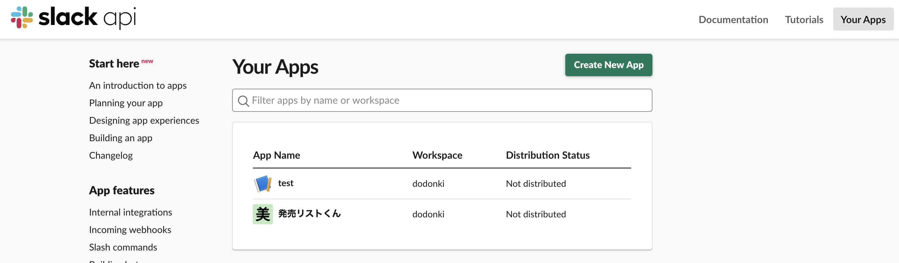
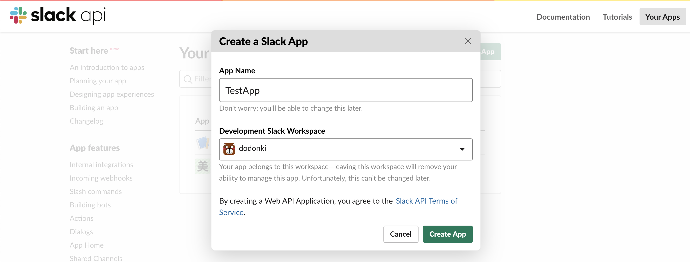
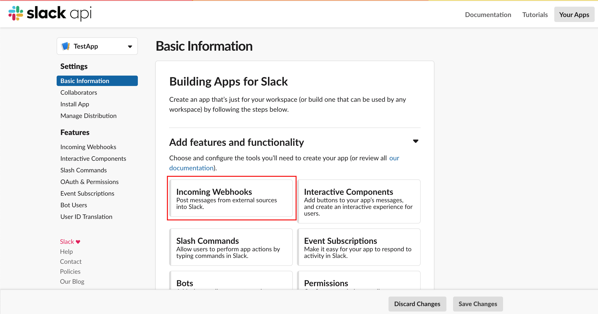
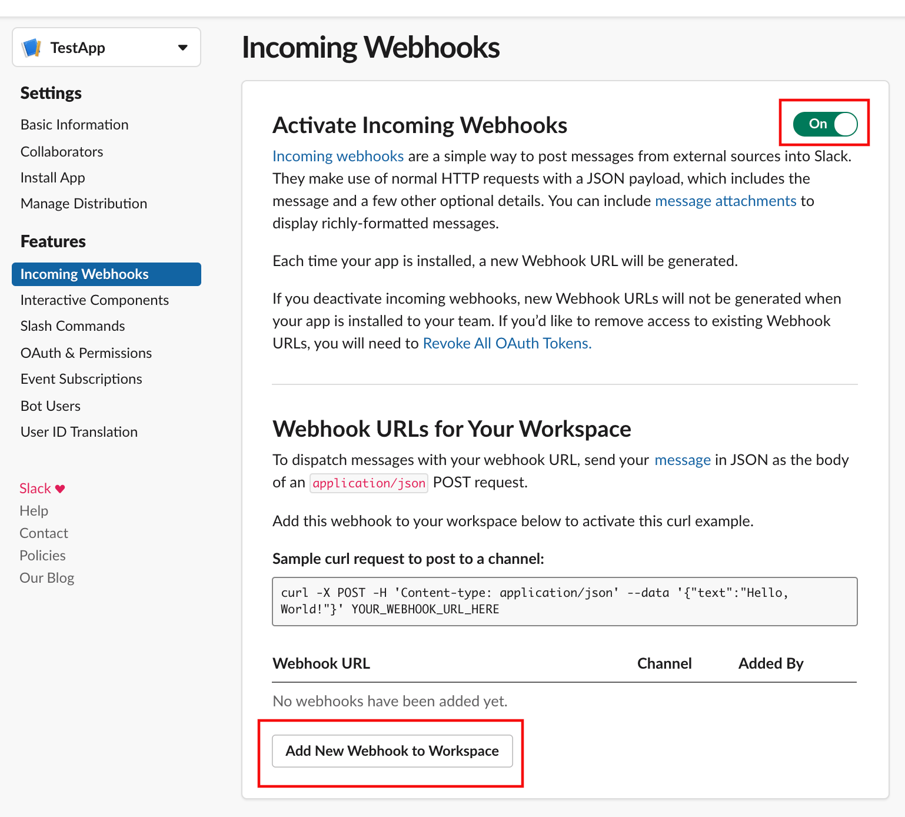
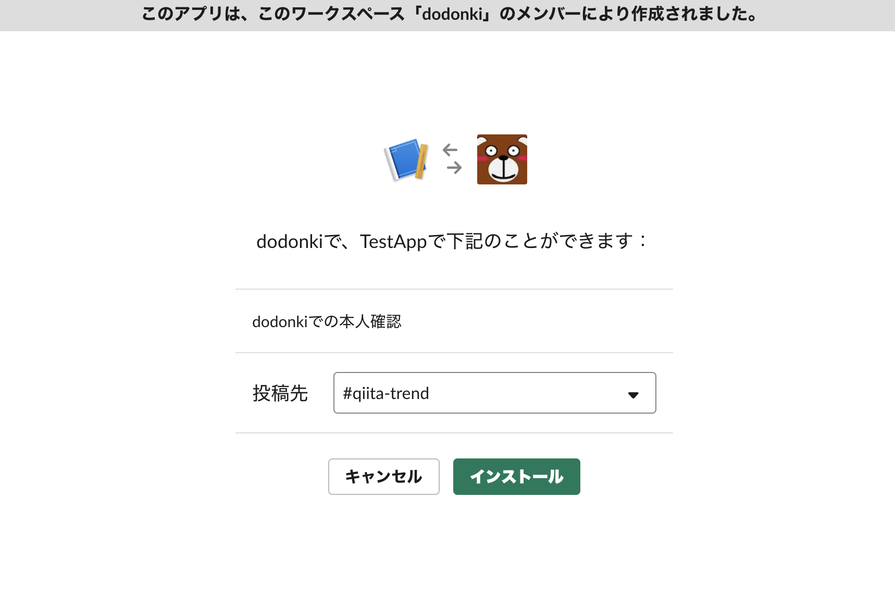
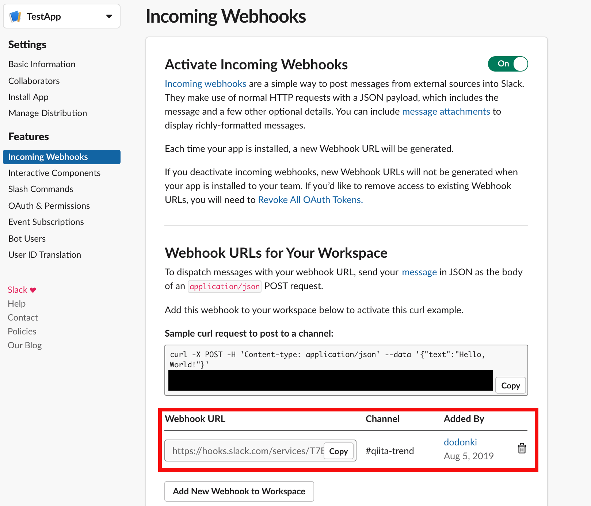

# qiita_trend_slack_notifier

`qiita_trend`gemを使用したSlack通知用のスクリプトです

## 使用方法

### Slackアプリの登録

まずは通知させるための[Slack App](https://api.slack.com/apps)を作成します。  
[Slack App](https://api.slack.com/apps)リンクをクリックしてページに遷移して下さい。



`Create New App`をクリックします。  



`App Name`,`Development Slack Warkspace`を記述して`Create App`をクリックします。



`Incoming Webhooks`をクリックします。  



`Off→On`に変更し、`Add New Webhook to Workspace`をクリックします。



`投稿先`を設定してインストールします。



`copy`をクリックすることでWebhook用のURLをコピーできます。  

### WebHookURLとQiitaにログインするためのユーザーとパスワードの設定を行う

`config.rb`を書き換えます
WeeklyとMonthlyを使用しない場合はユーザー名とパスワードの設定は必要ありません

```ruby
# frozen_string_literal: true

require 'qiita_trend'
require './qiita_notifier/configuration'

QiitaNotifier.configure do |config|
  # Qiitaでログイン出来るユーザー名とパスワードをセットしてください
  config.user_name = 'user_name' 　　　←　Qiitaにログインするユーザー名
  config.password = 'password' 　　　　←　Qiitaにログインするパスワード
  # Slackで作成したアプリのWebHookURLを設定してください
  config.web_hook_url = 'web_hook_url' ←　設定したWebHookURL
end

QiitaTrend.configure do |config|
  config.user_name = QiitaNotifier.configuration.user_name
  config.password = QiitaNotifier.configuration.password
end
```

### 実行コマンド

```shell
# dailyのトレンドをSlackに通知
$ ruby notify_trend.rb

# dailyのトレンドでNEWのものだけをSlackに通知
$ ruby notify_trend.rb --new

# weeklyのトレンドをSlackに通知
$ ruby notify_trend.rb -t weekly

# weeklyのトレンドでNEWのものだけをSlackに通知
$ ruby notify_trend.rb -t weekly --new

# monthlyのトレンドをSlackに通知
$ ruby notify_trend.rb -t monthly

# monthlyのトレンドでNEWのものだけをSlackに通知
$ ruby notify_trend.rb -t monthly --new
```